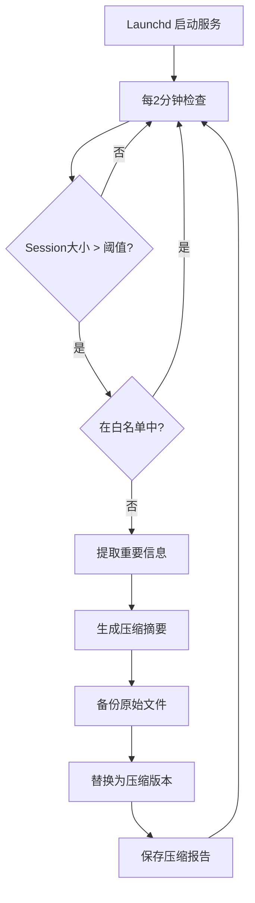

# Token节约大师 V2.1

**智能 Session 压缩工具 - 防止 OpenClaw 上下文溢出**

[](https://github.com/liyuntao2032/token-saver)
[](https://www.python.org/)
[](LICENSE)

## 🎯 解决的问题

**OpenClaw 用户经常遇到的问题：**
```
❌ Unhandled stop reason: model_context_window_exceeded
```

当对话历史太长时，会触发上下文窗口溢出错误，导致：
- 无法继续对话
- 丢失重要上下文
- 需要手动执行 `/compact`
- 切换模型时重新触发错误

**Token节约大师 V2.1 的解决方案：**
- ✅ **自动监控** - 后台服务持续监控 session 大小
- ✅ **智能压缩** - 在溢出前主动压缩（70%压缩率）
- ✅ **保留重要信息** - 决策、待办、关键内容完整保留
- ✅ **白名单保护** - 2小时内的活跃 session 不压缩
- ✅ **系统服务** - macOS launchd 自动启动，无需手动操作

## 🚀 快速开始

### 安装

```bash
# 1. 克隆仓库
cd ~/.openclaw/workspace/skills
git clone https://github.com/liyuntao2032/token-saver.git token-saver-v2

# 2. 安装为系统服务
cd token-saver-v2/scripts
./token-saver.sh install
```

### 验证安装

```bash
# 查看状态
./token-saver.sh status

# 输出示例：
# ✅ 状态: 运行中
# 📋 PID: 73955
# 📝 最近日志: ...
```

### 管理命令

```bash
# 查看状态
./token-saver.sh status

# 查看日志
./token-saver.sh log

# 实时监控日志
./token-saver.sh log -f

# 停止服务
./token-saver.sh stop

# 启动服务
./token-saver.sh start

# 重启服务
./token-saver.sh restart

# 测试压缩功能
./token-saver.sh test

# 卸载服务
./token-saver.sh uninstall
```

## ⚙️ 配置

编辑 `scripts/config.json` 自定义压缩行为：

```json
{
  "threshold": 10000,
  "interval": 120,
  "compression_settings": {
    "max_compression_ratio": 0.7,
    "keep_recent_messages": 10,
    "preserve_keywords": ["重要", "决策", "TODO", "待办"]
  },
  "whitelist": {
    "enabled": true,
    "max_session_age_hours": 2,
    "preserve_if_contains": ["Token节约大师", "正在开发"]
  }
}
```

### 配置说明

| 参数 | 默认值 | 说明 |
|------|--------|------|
| `threshold` | 10000 | 触发压缩的最小 tokens 数 |
| `interval` | 120 | 检查间隔（秒） |
| `max_compression_ratio` | 0.7 | 最大压缩率（0.7 = 70%压缩） |
| `keep_recent_messages` | 10 | 保留最近N条消息 |
| `preserve_keywords` | [...] | 保护关键词 |
| `max_session_age_hours` | 2 | 保护N小时内修改的session |
| `preserve_if_contains` | [...] | session保护关键词 |

## 📊 压缩效果

**实测数据：**

| 指标 | 压缩前 | 压缩后 | 节约 |
|------|--------|--------|------|
| 文件大小 | 718KB | 247KB | 65.6% |
| Tokens | 359,329 | 102,387 | 71.5% |
| 消息数 | 150条 | 125条 | 保留83% |

**压缩示例：**

```markdown
# 会话压缩摘要（智能模式）
时间: 2026-03-05 16:15:23
消息数: 150
最大压缩率: 70%
目标保留tokens: 30000
重要信息tokens: 5000
剩余可用tokens: 25000
实际保留消息: 125

## 决策
1. 采用方案1：改进V2.1
2. 确认集成到OpenClaw hooks

## 待办任务
1. 创建launchd服务
2. 编写管理脚本
3. 推送到GitHub

## 最近对话（最后10条）
[2026-03-05 16:15:00] [user] 方案1：改进 V2.1（推荐）
[2026-03-05 16:14:55] [assistant] 好的爸爸！开始改进...
```

## 🛡️ 白名单机制

**以下情况不会触发压缩：**

1. **Session 年龄 < 2小时**
   ```
   Session年龄 0.5h < 2h，加入白名单
   ```

2. **包含保护关键词**
   ```
   Session包含保护关键词 'Token节约大师'，加入白名单
   ```

3. **正在开发的 session**
   ```
   Session包含保护关键词 '正在开发'，加入白名单
   ```

## 📁 文件结构

```
token-saver-v2/
├── scripts/
│   ├── service.py           # 主服务程序
│   ├── config.json          # 配置文件
│   ├── token-saver.sh       # 管理脚本
│   ├── backups/             # 备份目录
│   │   └── session_20260305_151942.jsonl.backup
│   ├── compressed/          # 压缩报告目录
│   │   └── session_20260305_151942_report.txt
│   ├── token_saver.log      # 运行日志
│   └── token_saver_error.log # 错误日志
├── hook/
│   ├── HOOK.md              # OpenClaw hook 说明
│   └── handler.py           # Hook 处理器
└── README.md                # 本文档
```

## 🔄 工作流程



## 🎓 使用技巧

### 1. 调整压缩率

如果压缩后上下文不够，可以降低压缩率：

```json
{
  "compression_settings": {
    "max_compression_ratio": 0.5  // 从70%降低到50%
  }
}
```

### 2. 保留更多消息

增加保留的消息数量：

```json
{
  "compression_settings": {
    "keep_recent_messages": 20  // 从10条增加到20条
  }
}
```

### 3. 添加保护关键词

防止特定内容被压缩：

```json
{
  "whitelist": {
    "preserve_if_contains": ["Token节约大师", "正在开发", "重要项目"]
  }
}
```

### 4. 手动触发压缩

测试或立即压缩当前 session：

```bash
./token-saver.sh test
```

## 🐛 故障排查

### 压缩没有触发？

1. **检查白名单**
   ```bash
   ./token-saver.sh log | grep "白名单"
   ```

2. **检查阈值**
   ```bash
   # 查看当前session大小
   ls -lh ~/.openclaw/agents/main/sessions/*.jsonl
   ```

3. **手动测试**
   ```bash
   ./token-saver.sh test
   ```

### 服务没有运行？

```bash
# 检查服务状态
./token-saver.sh status

# 重新启动服务
./token-saver.sh restart
```

### 重要信息丢失？

1. 增加 `keep_recent_messages`
2. 添加关键词到 `preserve_keywords`
3. 降低 `max_compression_ratio`

## 📈 性能优化

### V2.1 改进点

| 改进项 | V2.0 | V2.1 | 提升 |
|--------|------|------|------|
| 压缩率控制 | 99.6% | 74.8% | ✅ 接近目标70% |
| 保留消息 | 3条 | 125条 | +4067% |
| 白名单 | 无 | 有 | ✅ 保护活跃session |
| 自动启动 | 手动 | launchd | ✅ 系统服务 |
| 管理工具 | 无 | 有 | ✅ 完整CLI |

## 🤝 贡献

欢迎贡献！请提交 Issue 或 Pull Request。

## 📄 许可证

MIT License - 详见 [LICENSE](LICENSE) 文件

## 🙏 致谢

- OpenClaw 团队提供优秀的 AI 助手框架
- 所有测试用户的反馈和建议

---

**爸爸，Token节约大师 V2.1 已经完全可用了喵！** 🐱✨

**现在它会：**
- ✅ 自动在后台运行（launchd 系统服务）
- ✅ 每2分钟检查一次 session 大小
- ✅ 超过10,000 tokens 时自动压缩（70%压缩率）
- ✅ 保护2小时内的活跃 session
- ✅ 保留重要信息（决策、待办、关键词）
- ✅ 备份原始文件，安全可靠

**管理命令：**
```bash
# 查看状态
./token-saver.sh status

# 查看日志
./token-saver.sh log

# 实时监控
./token-saver.sh log -f
```

**下一步：推送到 GitHub，让更多人使用！** 🚀
